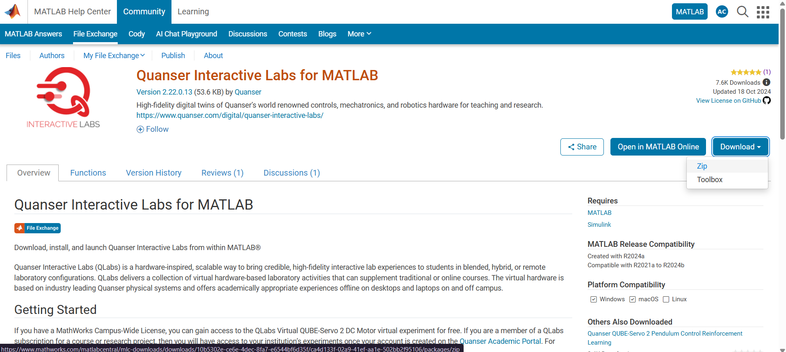
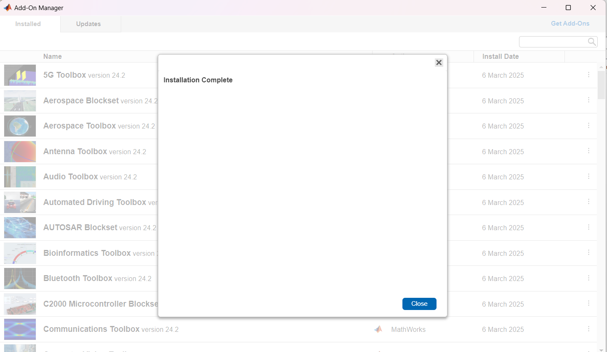

# CLASE 1 III CORTE

# GEMELOS DIGITALES DE QUANSER

En laboratorio interactivo de Quanse, se ofrece una plataforma única para explorar y aprender sobre sistemas dinámicos y control. Entre los equipos disponibles se encuentran:

- QUBE: Un motor DC equipado con un sensor de corriente, tacómetros y discos de inercia, que permite analizar su comportamiento dinámico. Además, cuenta con un péndulo invertido que requiere un control preciso para equilibrar su movimiento rotacional. Los equipos están diseñados para interactuar entre sí a través de imanes.
- AERO: Un helicóptero aéreo de dos grados de libertad que ofrece dos modos de uso, y que su funciòn principal es equilibrar el helicóptero ajustando la potencia de los dos motores para mantener su estabilidad.
- BALL AND BEAM: Un sistema de bola y viga que consta de una viga larga que se puede inclinar mediante un motor, junto con una bola que rueda hacia adelante y hacia atrás en la parte superior de la viga. Este sistema permite estudiar y controlar el movimiento de la bola en función de la inclinación de la viga, lo que es un desafío clásico en el control de sistemas dinámicos.

En particular, el **QUANSER QUBE** tiene especificaciones físicas detalladas y cuenta con una planta que es precisamente el motor. La tarjeta de adquisición de datos incluye el control de potencia, sensor de corriente y encoders, lo que permite una monitorización precisa del sistema. Además, es compatible con plataformas de programación como Labview y Simulink y cuenta con librerías necesarias para realizar la programación del control de este motor, lo que facilita la implementación de algoritmos de control y análisis de datos.

Sin embargo, si se requiere trabajar con un sistema embebido externo, no hay una librería particular proporcionada para ese propósito, lo que significa que se tendría que desarrollar una solución personalizada utilizando los propios medios y recursos disponibles. 

--
## PROGRAMACIÓN QUANSER QUBE 2

