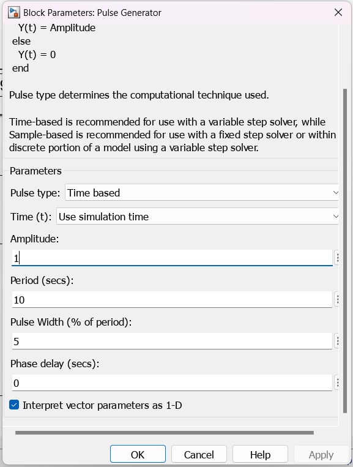

# CLASE 1 III CORTE

# GEMELOS DIGITALES DE QUANSER

En laboratorio interactivo de Quanse, se ofrece una plataforma única para explorar y aprender sobre sistemas dinámicos y control. Entre los equipos disponibles se encuentran:

- QUBE: Un motor DC equipado con un sensor de corriente, tacómetros y discos de inercia, que permite analizar su comportamiento dinámico. Además, cuenta con un péndulo invertido que requiere un control preciso para equilibrar su movimiento rotacional. Los equipos están diseñados para interactuar entre sí a través de imanes.
- AERO: Un helicóptero aéreo de dos grados de libertad que ofrece dos modos de uso, y que su funciòn principal es equilibrar el helicóptero ajustando la potencia de los dos motores para mantener su estabilidad.
- BALL AND BEAM: Un sistema de bola y viga que consta de una viga larga que se puede inclinar mediante un motor, junto con una bola que rueda hacia adelante y hacia atrás en la parte superior de la viga. Este sistema permite estudiar y controlar el movimiento de la bola en función de la inclinación de la viga, lo que es un desafío clásico en el control de sistemas dinámicos.

En particular, el **QUANSER QUBE** tiene especificaciones físicas detalladas y cuenta con una planta que es precisamente el motor. La tarjeta de adquisición de datos incluye el control de potencia, sensor de corriente y encoders, lo que permite una monitorización precisa del sistema. Además, es compatible con plataformas de programación como Labview y Simulink y cuenta con librerías necesarias para realizar la programación del control de este motor, lo que facilita la implementación de algoritmos de control y análisis de datos.

Sin embargo, si se requiere trabajar con un sistema embebido externo, no hay una librería particular proporcionada para ese propósito, lo que significa que se tendría que desarrollar una solución personalizada utilizando los propios medios y recursos disponibles. 

## PROGRAMACIÓN QUANSER QUBE 2
1. Registro en el portal de Quanser

2. Selección de Simulink Users

3. Descargar Toolbox

4. Instalación Licencia de Quanser Interactive Labs

5. Digitar QLabs.setup para dar inicio a la instalación de Quanser Interactive Labs

6. Dar click en instalar

7. Loggearse con el usuario del registro del paso 1

8. En la interfaz de Quanser Interactive Labs, seleccionar Qube 2 - DC Motor

9. Seleccionar Servo Workspace

10. En este paso ya se logró el acceso al gemelo digital. 

**PARA LA PROGRAMACIÒN**
1. Abrir una ventana de simulink desde la ventana principal de Matlab

2. Buscar en la libreria los componentes de QUARC Targets

3. Abrir la pestaña 'Data acquisition', luego 'generic', y finalmente 'configuration', y seleccionar HIL Initialize.  

4. Cambiar los parametros para realizar la conexión. 

5. Observar la banda led superior del cubo en color verde indicando la conexión exitosa. 

6. Siguiendo la ruta 'QUARC Targets' > 'Data acquisition' > 'generic' > 'Time bases', seleccionar 'HIL Read Encoder Timebase'

7. Configurar los parametros de la pestaña 'main' seleccionando 'Active during normal simulation'

8. Configurar los parametros de la pestaña 'main' seleccionando 'Synchronize'

9. Siguiendo la ruta 'QUARC Targets' > 'Data acquisition' > 'generic' > 'Inmediate I/O' seleccionar 'HIL Write Analog'

10. Seleccionar 'Active during normal simulation'

11. Agregar una constante a la entrada del HIL Write Analog

12. Configurar el solver para no tener problemas con la simulación. 

13. Observar el movimiento del QUBE con la configuraciòn dada previamente. 

14. Observar los datos en en el display.

15. Modificar el valor de la constante

16. Observar el cambio de los valores en el display respecto a la anterior simulación. 

